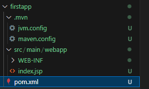

# bootcamp_spring

## Setup project
```
mvn archetype:generate -DarchetypeGroupId=org.apache.maven.archetypes -DarchetypeArtifactId=maven-archetype-webapp -DarchetypeVersion=1.5
```

|property|value|
|--|--|
|groupId|example|
|artifactId|firstapp|
|version|[none]|
|package|example.firstapp|

```
Define value for property 'groupId': example
Define value for property 'artifactId': firstapp
Define value for property 'version' 1.0-SNAPSHOT: 
Define value for property 'package' example: example.firstapp
Confirm properties configuration:
groupId: example
artifactId: firstapp
version: 1.0-SNAPSHOT
package: example.firstapp
 Y: y
[INFO] ----------------------------------------------------------------------------
[INFO] Using following parameters for creating project from Archetype: maven-archetype-webapp:1.5
[INFO] ----------------------------------------------------------------------------
[INFO] Parameter: groupId, Value: example
[INFO] Parameter: artifactId, Value: firstapp
[INFO] Parameter: version, Value: 1.0-SNAPSHOT
[INFO] Parameter: package, Value: example.firstapp
[INFO] Parameter: packageInPathFormat, Value: example/firstapp
[INFO] Parameter: package, Value: example.firstapp
[INFO] Parameter: groupId, Value: example
[INFO] Parameter: artifactId, Value: firstapp
[INFO] Parameter: version, Value: 1.0-SNAPSHOT
[WARNING] CP Don't override file /workspaces/bootcamp_spring/firstapp/src/main/webapp
[WARNING] CP Don't override file /workspaces/bootcamp_spring/firstapp/.mvn
[INFO] Project created from Archetype in dir: /workspaces/bootcamp_spring/firstapp
[INFO] ------------------------------------------------------------------------
[INFO] BUILD SUCCESS
[INFO] ------------------------------------------------------------------------
[INFO] Total time:  01:15 min
[INFO] Finished at: 2025-06-07T09:50:41Z
[INFO] ------------------------------------------------------------------------
```

